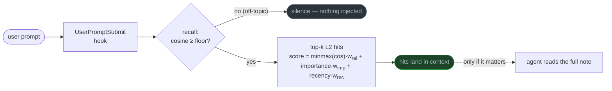
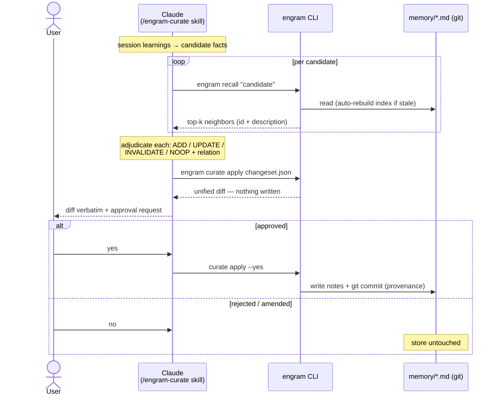

# engram

[](https://github.com/greenclaw/engram/actions/workflows/ci.yml)
[](https://github.com/astral-sh/ruff)
[](https://www.python.org)
[](LICENSE)

Curated, git-native, plain-text memory for Claude Code agents.

Your memory is a folder of markdown files that you own and edit. engram adds the two layers a
hand-curated store lacks — semantic recall and a reviewable curator — without taking the files
away from you.

- **Markdown is the source of truth.** Notes live in `memory/*.md` with YAML frontmatter, a
  `MEMORY.md` table of contents, and `[[links]]` between them. Everything stays readable,
  greppable, and versioned by git.
- **Recall is local and service-less.** A small ONNX embedding model (bge-m3) and a numpy index.
  No vector database, no daemon, nothing to keep running.
- **The curator proposes, never writes.** At session end, an LLM reviews what was learned and
  emits a change-set of ADD / UPDATE / INVALIDATE / NOOP operations, with contradictions detected
  rather than overwritten.
- **A human gate guards every commit.** You review a unified diff before anything touches the
  store; git keeps the provenance. The gate doubles as the defense against memory poisoning.

Each of these ingredients exists in some tool already; none combines all four. The survey and
prior-art verdict are in [`RESEARCH.md`](RESEARCH.md).

## Install

Requires Python 3.11+, [`uv`](https://docs.astral.sh/uv/), and the `BAAI/bge-m3` ONNX model in
your local Hugging Face cache — engram never downloads models on its own.

```bash
git clone git@github.com:greenclaw/engram.git && cd engram
uv sync
uv run pytest -q   # model-dependent tests skip if bge-m3 isn't cached
```

## Quickstart

```bash
# index a directory of *.md notes with frontmatter
uv run engram index --dir ~/.claude/projects/<proj>/memory

# semantic recall: top-k notes, scored by relevance, importance, and recency
uv run engram recall "how do we deploy to production?" --dir <memory/> -k 5

# apply a curator change-set behind the human gate: diff, y/N, git commit
uv run engram curate apply changeset.json --dir <memory/>
```

### Live recall in Claude Code sessions

Install the CLI once and register two hooks globally in `~/.claude/settings.json`:

```bash
uv tool install /path/to/engram
```

```json
{"hooks": {
  "UserPromptSubmit": [{"hooks": [{"type": "command", "command": "engram hook"}]}],
  "Stop": [{"hooks": [{"type": "command", "command": "engram pending add"}]}]}}
```

From then on, every prompt in every project is recalled against that project's store and relevant
notes land in context. Off-topic prompts stay silent thanks to an abstention floor, and a hook
failure never blocks the prompt.

When `--dir` is omitted, engram derives the store from the working directory: the Claude Code
auto-memory path `~/.claude/projects/<slug>/memory`, with worktree sessions mapped to their main
project. Projects without a store are simply skipped. If hooks can't see your PATH, use the
binary's absolute path (`~/.local/bin/engram`) — a failing UserPromptSubmit hook would otherwise
block the prompt.

The Stop hook is cheap: it only queues the finished session's transcript path for later curation,
deduplicated per session. The LLM work happens offline, the next time `/engram-curate` runs
(`engram pending list` / `clear` inspect the queue).

To pause everything instantly, set `ENGRAM_DISABLE=1`. Both hooks go silent without editing
settings or restarting sessions; explicit CLI commands keep working.

### Curation

The `/engram-curate` skill (`.claude/skills/engram-curate/`) drives the write path. Claude gathers
the session's learnings, recalls each candidate's neighbors, decides the operation and its relation
to existing notes (compatible, contradictory, subsumes, subsumed), and hands one change-set to
`engram curate apply` — which shows you the diff and writes nothing until you approve. A
contradiction marks the old note with `invalidated_by:` and keeps it; both git and the file hold
the history.

For scripted flows there is a calibrated auto-gate. `curate apply --auto-threshold 0.770`
auto-approves a change-set only when every change carries `confidence ≥ τ` and none of them
rewrites hand-written note prose — body edits always fall back to the human gate. The threshold
comes from `bench_curate.py`'s μ−2σ calibration; recalibrate it for your own model before relying
on it.

## How it works

The source of truth is `memory/*.md` with frontmatter (`name`, `description`, `type`,
`importance`, `updated`, `invalidated_by`) plus the `MEMORY.md` index. Everything else is derived
and disposable.

The read path — service-less semantic recall on every prompt:



The write path — the curator proposes, the human gate decides, git remembers:



Both diagrams encode the same invariant: the LLM never writes the store. Reads flow through
recall, writes flow through the gate, and only `engram` — after your explicit yes — touches the
files.

A few design notes:

- **Scoring** is a weighted sum in the Generative Agents style, with min-max-normalized relevance.
  Raw cosine similarity is compressed into a narrow band; without normalization, importance and
  recency would drown out the actual query match. The weights are tunable.
- **Abstention.** Hits below a raw-cosine floor (`ENGRAM_RELEVANCE_FLOOR`, default 0.35) are
  dropped, so an off-topic query returns nothing instead of a confidently wrong note.
- **The index is disposable.** `.engram/` rebuilds from the markdown whenever notes are added,
  edited, or deleted. The files remain the authority.
- **Change-sets are untrusted input.** Paths are contained to the store, duplicate targets and
  missing fields fail loudly, and commits use explicit pathspecs so your staged files are never
  swept up.

## Validation

The instruments live in the repo; the caveats are part of the results.

| Bench | Headline | Fine print |
|---|---|---|
| `bench_recall.py` | semantic 100%@5 vs lexical 0%@5 | paraphrase set constructed for zero lexical overlap (n=12) — proves the semantic gap closes, not an effect size |
| `bench_curate.py` | op-accuracy 100%, contradiction-catch 100%, false-invalidates 0, over 3 runs | clean-case set, adjudicated by headless `claude -p` |
| `bench_curate.py` (hard set) | same 100/100/0 over 5 runs; gate calibration τ=0.770, coverage 95% | confusable neighbors, value-change-vs-contradiction boundaries, cross-lingual; risk 0/60 is an upper bound (≲5% at 95% CI), not a measurement — auto-commit stays opt-in |
| `bench_quality.py` | confusables p@1 88%, negation 100%, exact-keyword 100%, RU↔EN 100%; 112-note store recalls identically to 12 notes | small n per dimension (4–12); the p@1 misses trace to scoring weights, not retrieval; one off-topic leak at cosine 0.374, inside the known 0.37–0.45 overlap band |

## Guardrails

These are non-negotiable and define the design:

- Markdown files are the source of truth; every index is a rebuildable secondary.
- No running service, no external database, no daemon.
- The curator never writes durable memory directly — diff, then gate, then commit.
- Invalidate, don't delete; never clobber curated prose.
- Curation runs offline at session end, never inline in a task.

## Docs

- [`RESEARCH.md`](RESEARCH.md) — the landscape (academic, production, and note-native prior art),
  the mechanisms reused with attribution, and the hard axis: forgetting, contradiction, temporal
  validity, poisoning.
- [`PLAN.md`](PLAN.md) — architecture, resolved design decisions, build increments with their
  done-when criteria.
- [`CONTEXT.md`](CONTEXT.md) — the hand-run memory practice engram grew out of.
- [`CLAUDE.md`](CLAUDE.md) — working guide for agents in this repo.

## Roadmap

- An error-producing curation set (or real-usage telemetry) before auto-commit becomes a default;
  today's risk estimate is a bound, not a measurement.
- Auto-tuned scoring weights, calibrated against the benches (`RESEARCH.md` §6).

## License

[Apache-2.0](LICENSE)
