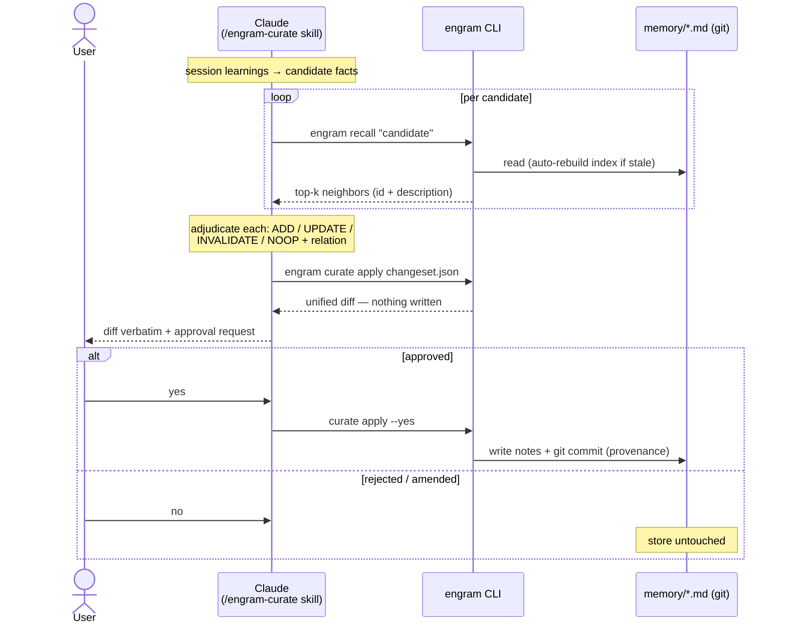

# engram

Curated, git-native, plain-text **agent memory** for Claude Code.

Your memory is markdown files in a directory you own. engram adds the two layers a hand-curated
store lacks — **semantic recall** and a **gated LLM curator** — without taking the files away from you:

1. **Markdown Zettelkasten is the source of truth** — `memory/*.md` notes with YAML frontmatter,
   a `MEMORY.md` index, `[[links]]`. Human-readable, grep-able, git-versioned.
2. **Semantic recall** over those files — local ONNX bge-m3, a `.npy` index, one matmul. No service,
   no vector DB, no daemon.
3. **An LLM curator that proposes, never writes** — it emits a reviewable **ADD / UPDATE / INVALIDATE /
   NOOP change-set**, contradiction-aware (invalidate-don't-delete).
4. **A human gate before every commit** — you approve the unified diff; git keeps provenance.
   The gate doubles as a memory-poisoning defense (MINJA-class attacks).

Each ingredient exists somewhere (basic-memory, DiffMem, Mem0, Hermes, A-MEM); **no tool fuses all
four**. engram is that assembly — see [`RESEARCH.md`](RESEARCH.md) for the survey and prior-art verdict.

## Install

Requires Python ≥3.11, [`uv`](https://docs.astral.sh/uv/), and the `BAAI/bge-m3` ONNX model in your
local Hugging Face cache (engram never downloads — `local_files_only`):

```bash
git clone git@github.com:greenclaw/engram.git && cd engram
uv sync
uv run pytest -q   # model-dependent tests skip if bge-m3 isn't cached
```

## Quickstart

```bash
# index a memory dir (any directory of *.md notes with frontmatter)
uv run engram index --dir ~/.claude/projects/<proj>/memory

# semantic recall: top-k note ids + descriptions, scored recency × importance × relevance
uv run engram recall "how do we deploy to production?" --dir <memory/> -k 5

# apply a curator change-set behind the human gate (diff → y/N → git commit)
uv run engram curate apply changeset.json --dir <memory/>
```

### Live recall in Claude Code sessions

Register the hook — every prompt is semantically recalled against your store, hits land in context,
irrelevant prompts stay silent (abstention floor), failures never block the prompt:

```json
{"hooks": {"UserPromptSubmit": [{"hooks": [{"type": "command",
  "command": "uv run --project /abs/path/to/engram engram hook --dir <memory-dir>"}]}]}}
```

Use an **absolute** `--project` path (or `uv tool install /abs/path/to/engram` and drop `uv run
--project`, calling just `engram hook`). Don't rely on `$CLAUDE_PROJECT_DIR`: registered in a project
that isn't engram, `uv` can't find the command and exits non-zero — and a non-zero UserPromptSubmit
hook blocks the prompt.

### Session-end curation queue (Stop hook)

Register the Stop hook and every finished session is queued for curation (fast — it only records the
transcript path, deduped per session; the LLM work stays offline in the skill):

```json
{"hooks": {"Stop": [{"hooks": [{"type": "command",
  "command": "uv run --project /abs/path/to/engram engram pending add --dir <memory-dir>"}]}]}}
```

The next `/engram-curate` run drains the queue (`engram pending list` / `clear`).

### Curation

The `/engram-curate` skill (`.claude/skills/engram-curate/`) drives the write path: Claude gathers
session learnings → recalls neighbors per candidate → adjudicates the op + relation
(compatible | contradictory | subsumes | subsumed) → emits one change-set → `engram curate apply`
shows you the diff. **Only your explicit approval writes** (`--yes` after review); contradictions
mark the old note `invalidated_by:` and keep it — git and the file both hold history.

For scripted flows there is a **bench-calibrated auto-gate**: `curate apply --auto-threshold 0.770`
auto-approves only when every change carries `confidence ≥ τ` and nothing rewrites hand-written note
prose (body-UPDATEs always fall back to the human gate). τ comes from `bench_curate.py`'s μ−2σ
calibration — recalibrate for your model before trusting it.

## How it works

Source of truth: `memory/*.md` with frontmatter `{name, description, type, importance, updated,
invalidated_by}` + a `MEMORY.md` L1 index. Everything else is derived.

**Read path** — service-less semantic recall, live on every prompt via the hook:


**Write path** — the curator proposes, the human gate decides, git remembers:



The invariant both diagrams encode: **the LLM never writes the store** — reads flow through recall,
writes flow through the gate, and only `engram` (after your explicit yes) touches the files.

- **Scoring** is the Generative-Agents weighted sum with min-max-normalized relevance (raw cosine is
  compressed; without normalization note-type would outrank query match). Weights are tunable knobs.
- **Abstention**: hits under a raw-cosine floor (`ENGRAM_RELEVANCE_FLOOR`, default 0.35) are dropped —
  an off-topic query returns nothing rather than a confidently wrong hit.
- **The index is disposable**: `.engram/` (`.npy` + `meta.json`) rebuilds from the markdown on any
  drift (add/edit/delete detected via count+mtime). Files stay the authority.
- **Change-sets are untrusted input**: paths are contained to the store, duplicate targets and missing
  fields fail loud, commits use explicit pathspecs (never sweep your staged files).

## Validation (instruments in-repo, honest caveats)

| Bench | Result | Caveat |
|---|---|---|
| `bench_recall.py` — semantic vs lexical A/B | **100%@5 / 67%@1 vs 0%** lexical | constructed zero-overlap paraphrase set (n=12) — an existence proof of closing the semantic gap, not an effect size |
| `bench_curate.py` — curator op-precision via headless `claude -p` | **op_accuracy 100%, contradiction-catch 100%, false-invalidate 0** (3/3 runs) | clean-case set |
| `bench_curate.py --dataset …_hard.json` — boundary set (confusable neighbors, value-change-vs-contradiction, cross-lingual) + μ−2σ gate calibration | **100/100/0 × 5 runs → τ=0.770, coverage 95%, risk 0%** (n=60) | risk=0 is a bound, not a measurement — no run produced an op error (0/60 ⇒ ≲5% at 95% CI); auto-commit stays opt-in (`--auto-threshold`) |
| `bench_quality.py` — confusables / negation / exact-keyword / cross-lingual / scale | confusables **p@1 88%**, negation **100%**, keyword **100%**, RU↔EN **100%**; **scale 112 notes = 12-note baseline** (p@1 67%, hit@5 100%, same misses) | small n per dim (4–12) — smoke coverage; @1 misses are the scoring-weights artifact (§6 knob), not retrieval; off-topic abstention 2/3 (one leak at cosine 0.374, inside the known 0.37–0.45 overlap band) |

## Guardrails (non-negotiable)

- Markdown files are the source of truth; any index is a rebuildable secondary.
- No running service, no external DB, no daemon.
- The curator never writes durable memory directly — diff → gate → commit.
- Invalidate-don't-delete; never clobber curated prose (UPDATE preserves untouched frontmatter).
- Curation runs offline (session end), not inline in a task.

## Docs

- [`RESEARCH.md`](RESEARCH.md) — the landscape (academic + production + note-native prior art), what
  we reuse with attribution, the hard axis (forgetting/contradiction/temporal/poisoning), the
  ML-rotation research flow.
- [`PLAN.md`](PLAN.md) — architecture, resolved design decisions, increments with done-when criteria.
- [`CONTEXT.md`](CONTEXT.md) — the hand-run memory practice engram grew out of.
- [`CLAUDE.md`](CLAUDE.md) — working guide for agents in this repo.

## Roadmap

- An error-producing curate set (or real-usage telemetry) before auto-commit becomes a default —
  today's `--auto-threshold` risk estimate is a bound (0/60), not a measurement.
- Auto-tuned scoring weights (Bayesian/CMA-ES against the bench) — `RESEARCH.md` §6.

## License

[Apache-2.0](LICENSE)
